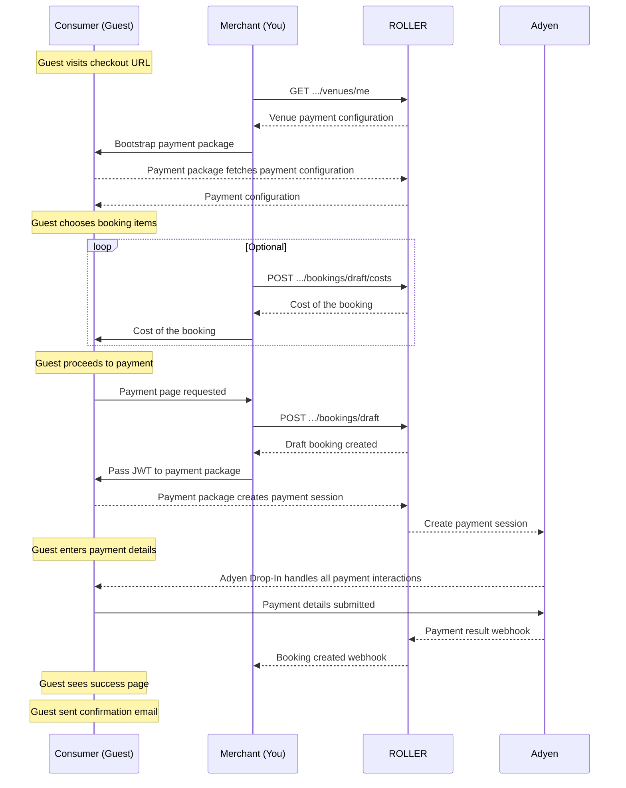

# ROLLER Payments via API

This page outlines the steps required to integrate ROLLER Payments via API for processing payments through a custom checkout.

<!-- theme: warning -->
> Before attempting this integration **you must contact ROLLER support** or your account manager for us to confirm your technical suitability and to authorize your connection. 

## Workflow

1. **Guest visits custom checkout**
   1. Merchant (You) calls [**Get Venue Detail**](../reference/rest-api.yaml/paths/~1venues~1me/get) endpoint to retrieve venue information containing payment configuration settings. This should be cached as it rarely changes.
   2. Custom checkout bootstraps ROLLER's payment library using the retrieved payment configuration settings.
   3. Payment package fetches payment configuration from Adyen
2. **Guest chooses booking items**
   1. Merchant can optionally use [**Booking Costs**](../reference/rest-api.yaml/paths/~1bookings~1draft~1costs/post) to calculate the cost of the booking. This uses the same structure as the draft endpoint which is also the same structure as creating a booking.
3. **Guest proceeds to payment**
   1. Merchant calls [**Create Draft Booking**](../reference/rest-api.yaml/paths/~1bookings~1draft/post). The response includes a unique ID for the booking, booking costs and the payment JWT required to setup payment on the custom checkout.
   2. Custom checkout calls `setupPayment` on the payment library, passing in the payment JWT. Payment drop-in is rendered with a new payment session and the guest can now enter their payment details.
4. **Guest enters payment details**
   1. The adyen drop-in component will provide status on the success of the payment which can be used to redirect the guest.
   2. A booking `created` [**webhook**](booking-webhook.md) can also be used to determine if the booking was successful. A webhook will not be sent if unsuccessful.
5. **Guest sees success page**
6. **Guest sent confirmation email**



---

## Implementation Requirements

1. This integration is not suitable for all users, so first reach out to ROLLER support to confirm your suitability and for us to authorize your connection
2. You will need to implement your test site first using the ROLLER Playground environment, see [**Testing on the Playground Environment**](environments.md).
3. You will need to request ROLLER to allowlist your domain/url for both test, and production sites. These sites must be publicly accessible domains over a secure HTTPS connection.
4. A latest copy of our internal npm package for ecom-payments used by our checkout can be downloaded via the [**Version History**](roller-payments-version-history.md) page. This file also contains the required Adyen dependencies.
   1. If the included Adyen dependency does not work, Adyen provides an npm package and direct links [**here**](https://docs.adyen.com/online-payments/web-drop-in/#set-up).
   2. Note that the CSS stylesheet version needs to match the JS version.


---

## Example

Below is an example for a custom checkout interacting with our payment library:

```csharp

const paymentService = new EcomPaymentService();

// Provided via API
const config = { 
    integrationId: '[INTEGRATION_ID]', 
    configurationId: '[CONFIGURATION_ID]', 
    apiUrl: '[API_URL]' 
};

// Http must be wired up.  Logging is informational.
const actions = {
    log: {
        info: (message: string) => console.log(message),
        warn: (message: string) => console.log(message),
        error: (message: string) => console.log(message)
    },
    http: {
        // Return the body/data from the response, not the full response
        post: (url: string, data: any) => this.http.post(url, data).toPromise().then((response: any) => response),
        get: (url: string) => this.http.get(url).toPromise().then((response: any) => response)
    }
} as IPaymentAction;

// Bootstrap the payment library when Merchant app loads to determine if Merchant need to handle a payment redirect result
paymentService.bootstrap(config, actions).then(
    () => {
          if (paymentService.hasRedirectResult()) {
          this.handleRedirectResult();
      }
    },
    () => console.log('Payment bootstrap failed'));
}

handleRedirectResult() {
    paymentService.handleRedirect({
        onPaymentReceived: () => {
            // Optionally handle initial pending state.  We wait a few seconds
            // for more information about the payment, use this to inform the user.
        },
        onPaymentCompleted: (result: IPaymentResult) => {
          // Route user to success page or handle the failed attempt
        }
    });
}

// Only setup payment once Merchant reach Merchant payment page since the HTML div with id paymentContainerDivId must exist
setupPayment() {
    const paymentRequest = {
        jwt: '[JWT]', // Provided via API
        hasRecurringBilling: false,
        redirectUrl: window.location.origin + window.location.pathname,
        paymentContainerDivId: 'payment-container',
        paymentMethodNames: undefined, // Optionally override payment method names
        handlers: {
            onReady: () => {},
            onBeforeSubmit: () => { /* return a promise, otherwise remove this handler */ },
            onPaymentReceived: () => {},
            onPaymentCompleted: (result: IPaymentResult) => {
            // Route user to success page or handle the failed attempt
        }
      },
    };

    paymentService.setup(paymentRequest).then(
        () => console.log('Payment ready'),
        (error: any) => console.log(error));
}

```

---

## FAQ

### How are payments (or refunds) processed for existing bookings?

Currently, the ROLLER Payments API does not support capturing additional payments or issuing refunds for existing bookings. However, you can still record an external payment using the [**add payment**](../reference/rest-api.yaml/paths/~1bookings~1{uniqueId}~1payments/post) endpoint.
